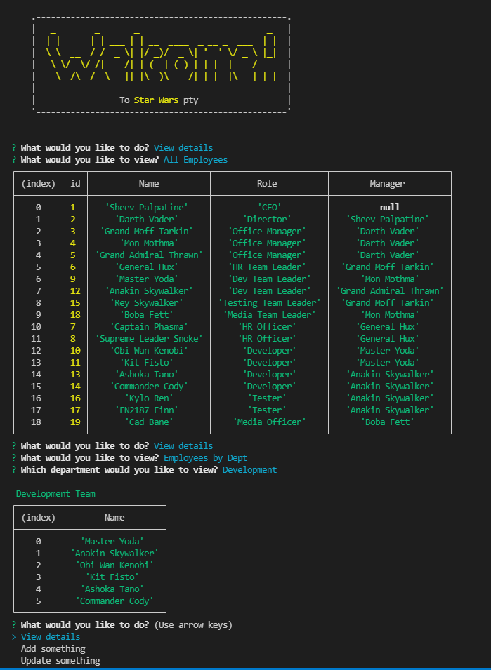

## Employee Tracker - Steve Barry

##  The Task

The task was to build from scratch a CLI CMS application to manage a company's employee database.

### ⭐ ⭐ S.T.A.R. ⭐ ⭐

**SITUATION**

The provided user story was: 

> AS A business owner
> 
> I WANT to be able to view and manage the departments, roles, and employees in my company
> SO THAT I can organize and plan my business

**TASK**

Provide a solution that allows a business owner to viecreate, review, update, and delete departments, employees, and roles within their company.

**ACTION**

Writing of a solution to resolve the situation, including:
* Javascript
  * *Error free performance*
  * *Multiple functions to separate aspects of code*
  * *Thorough comments*
* GIT
  * *Numerous commits to track changes in code*
  * *Code added to public repository and Github Pages for public viewing*
* Functionality
  * *Multiple functions to allow a user carry out al of their required tasks*
  * *Error handling, with feedback to users*

**RESULT**

The end code is stored on Github, and publicly available and viewable. This result meets all requirements of the User Story and acceptance criteria:

* GIVEN a command-line application that accepts user input
* ~~WHEN I start the application~~
* ~~THEN I am presented with the following options: view all departments, view all roles, view all employees, add a department, add a role, add an employee, and update an employee role~~
* ~~WHEN I choose to view all departments~~
* ~~THEN I am presented with a formatted table showing department names and department ids~~
* ~~WHEN I choose to view all roles~~
* ~~THEN I am presented with the job title, role id, the department that role belongs to, and the salary for that role~~
* ~~WHEN I choose to view all employees~~
* ~~THEN I am presented with a formatted table showing employee data, including employee ids, first names, last names, job titles, departments, salaries, and managers that the employees report to~~
* ~~WHEN I choose to add a department~~
* ~~THEN I am prompted to enter the name of the department and that department is added to the database~~
* ~~WHEN I choose to add a role~~
* ~~THEN I am prompted to enter the name, salary, and department for the role and that role is added to the database~~
* ~~WHEN I choose to add an employee~~
* ~~THEN I am prompted to enter the employee’s first name, last name, role, and manager, and that employee is added to the database~~
* ~~WHEN I choose to update an employee role~~
* ~~THEN I am prompted to select an employee to update and their new role and this information is updated in the database~~

##  The Outcome

As the acceptance criteria has been met and exceeded, the task is now complete. 

Here is a screenshot of the application:

> 

---

Written by Steve Barry - Due date 28/2/2022

© 2021 Trilogy Education Services, LLC, a 2U, Inc. brand. Confidential and Proprietary. All Rights Reserved.

